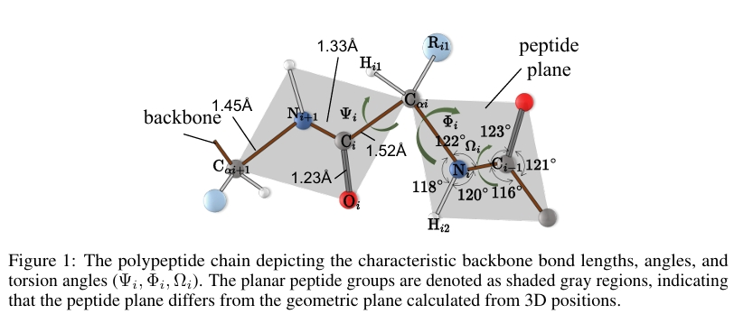

# CoupleNet
Learning Complete Protein Representation by Dynamically Coupling of Sequence and Structure. 
[[paper]](https://proceedings.neurips.cc/paper_files/paper/2024/hash/f8de10c9ff056ae3d1eef43ad1762351-Abstract-Conference.html)


## Dataset
From [GearNet](https://github.com/DeepGraphLearning/GearNet) and [IEConv](https://github.com/phermosilla/IEConv_proteins)

## File Specification
datasets.py gives some dataset functions to process data, including the amino acid types and the physicochemical properties of each residue, namely, a
steric parameter, hydrophobicity, volume, polarizability, isoelectric point, helix probability, and sheet probability. Besides, the geometric features are included.

## Dependencies
PyTorch 1.13.1

PyG, transformers

torch-geometric

pip install transformers

PyTorch Scatter

...


### License
The code is released under MIT License.


### Related Repos
Thanks for these great work:

1. [CDConv](https://github.com/hehefan/Continuous-Discrete-Convolution) &emsp; 2. [GearNet](https://github.com/DeepGraphLearning/GearNet) 

### Citation
```
@article{hu2024learning,
  title={Learning Complete Protein Representation by Dynamically Coupling of Sequence and Structure},
  author={Hu, Bozhen and Tan, Cheng and Xia, Jun and Liu, Yue and Wu, Lirong and Zheng, Jiangbin and Xu, Yongjie and Huang, Yufei and Li, Stan Z},
  journal={Advances in Neural Information Processing Systems},
  volume={37},
  pages={137673--137697},
  year={2024}
}
```
